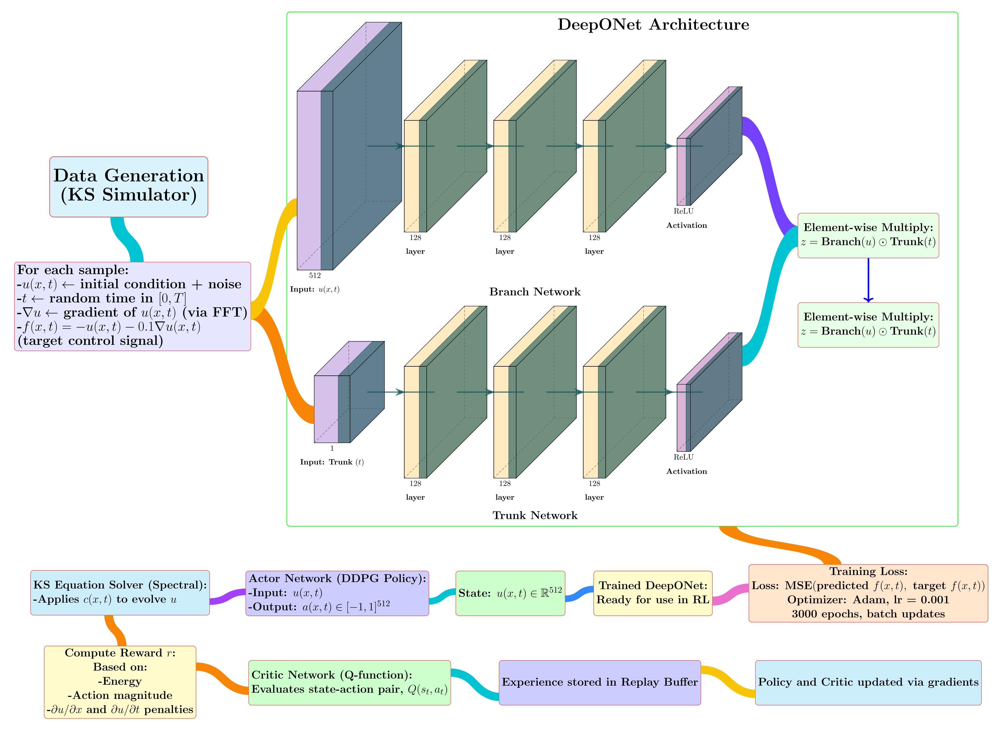

# 🧠 Stabilizing the Kuramoto–Sivashinsky Equation Using Deep Reinforcement Learning with a DeepONet Prior

[](https://icml.cc/)
[](LICENSE)

> 📍 Accepted at the **Muslims in ML Workshop**, co-located with **ICML 2025**, Vancouver, Canada.  
> 📄 [Read the Paper (PDF)](MUSLML_ICML2025_DeepONet_Reinforcement_Learning_Nadim_et_al.pdf)  
> 🖼️ [View the Poster (PDF)](Muslim-ICML.pdf)

---

## 🖼️ Poster Preview

<p align="center">
  <a href="Muslim-ICML.pdf">
    
  </a>
</p>

---

## 📝 Abstract

This paper presents a novel reinforcement learning framework that leverages DeepONet priors to stabilize the Kuramoto–Sivashinsky (KS) equation. DeepONet first learns a generalized control operator offline, which is refined online using Deep Deterministic Policy Gradient (DDPG) to adapt to trajectory-specific dynamics. The approach achieves a 55% energy reduction within 0.2 time units and narrows chaotic fluctuations significantly, outperforming traditional feedback control. DeepONet reduces MSE by 99.3%, while the RL agent improves mean episode reward by 59.3%. The method offers a scalable and effective solution for controlling complex, high-dimensional nonlinear systems.

---

## 👨‍🔬 Authors

- Nadim Ahmed — [@nadiml](https://github.com/nadiml)  
- Md. Ashraful Babu  
- Md. Mortuza Ahmmed  
- M. Mostafizur Rahman  
- [Mufti Mahmud](https://scholar.google.com/citations?user=L8em2YoAAAAJ&hl=en)

---

## 🔗 Related Links

- 📄 [Read the Paper (PDF)](MUSLML_ICML2025_DeepONet_Reinforcement_Learning_Nadim_et_al.pdf)
- 🖼️ [View the Poster (PDF)](Muslim-ICML.pdf)
- 🎥 [Presentation Video](https://www.youtube.com/watch?v=3eUBd3gUv88)
- 📊 [Muslims in ML Workshop](https://www.musiml.org/)
- 🌐 [ICML 2025 Conference](https://icml.cc/)

---

## 🧰 Requirements

- Python 3.9+
- PyTorch ≥ 1.13
- NumPy, SciPy
- Matplotlib
- Gym / Stable-Baselines3

### Install all dependencies:

```bash
pip install -r requirements.txt
